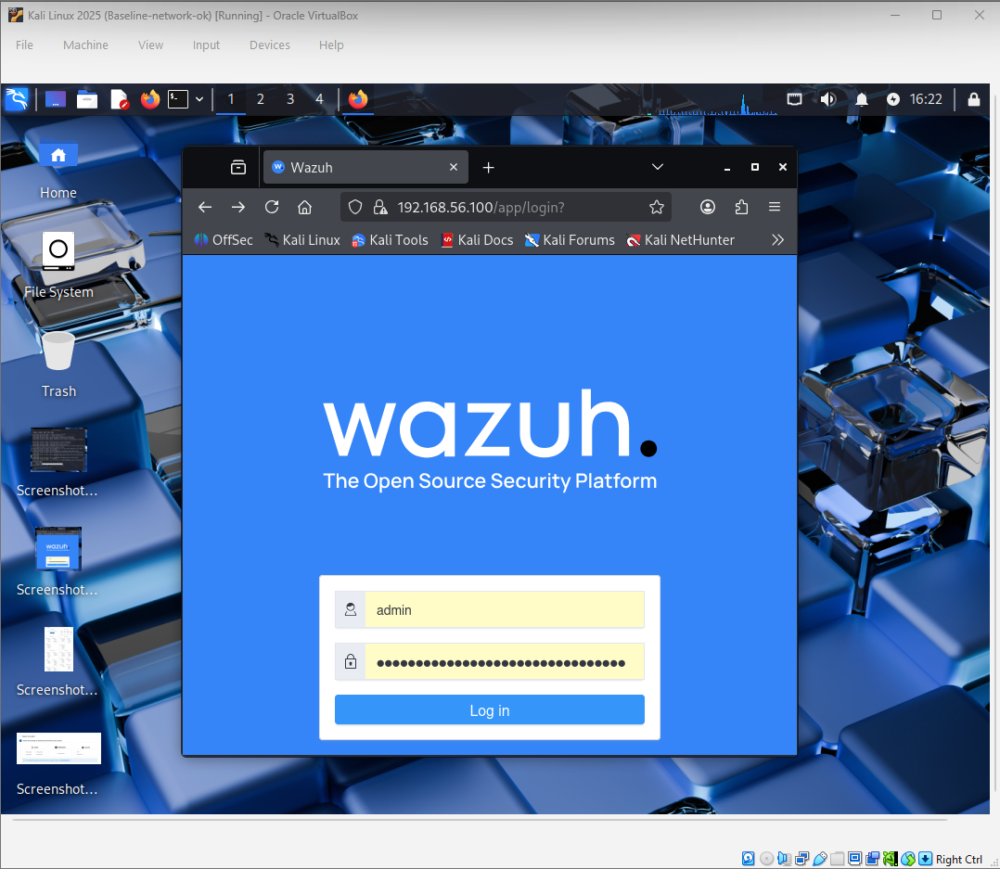
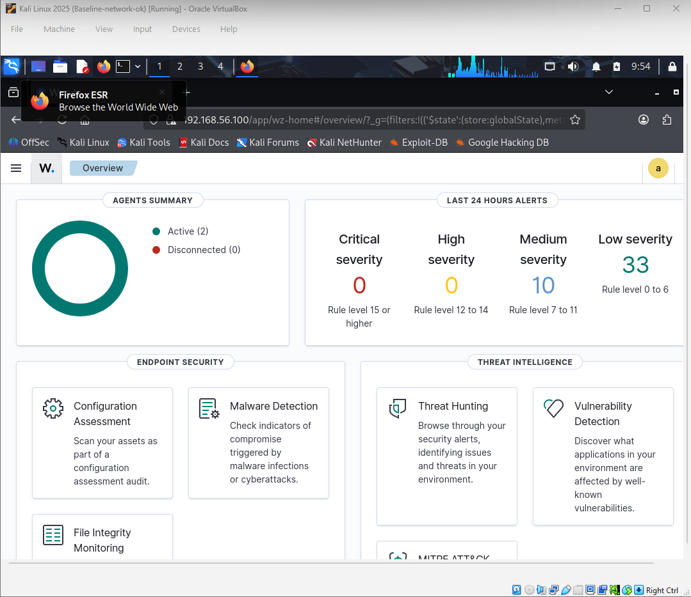
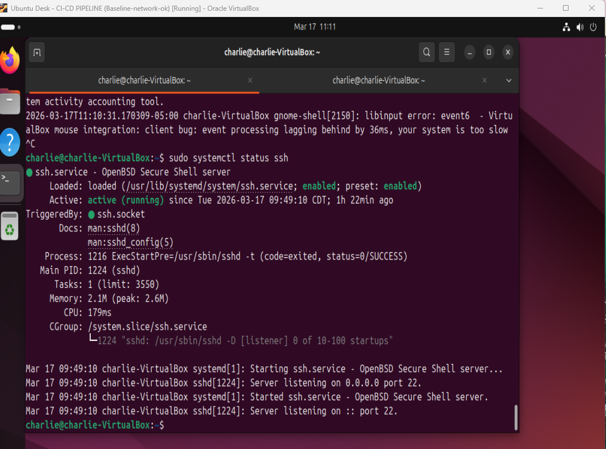
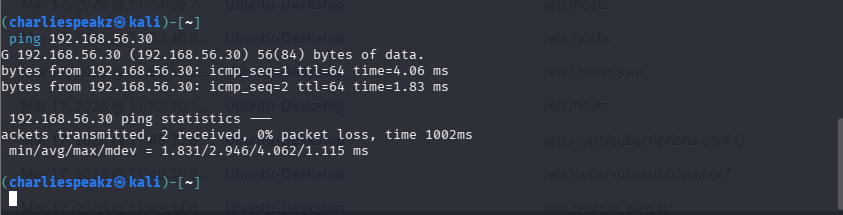
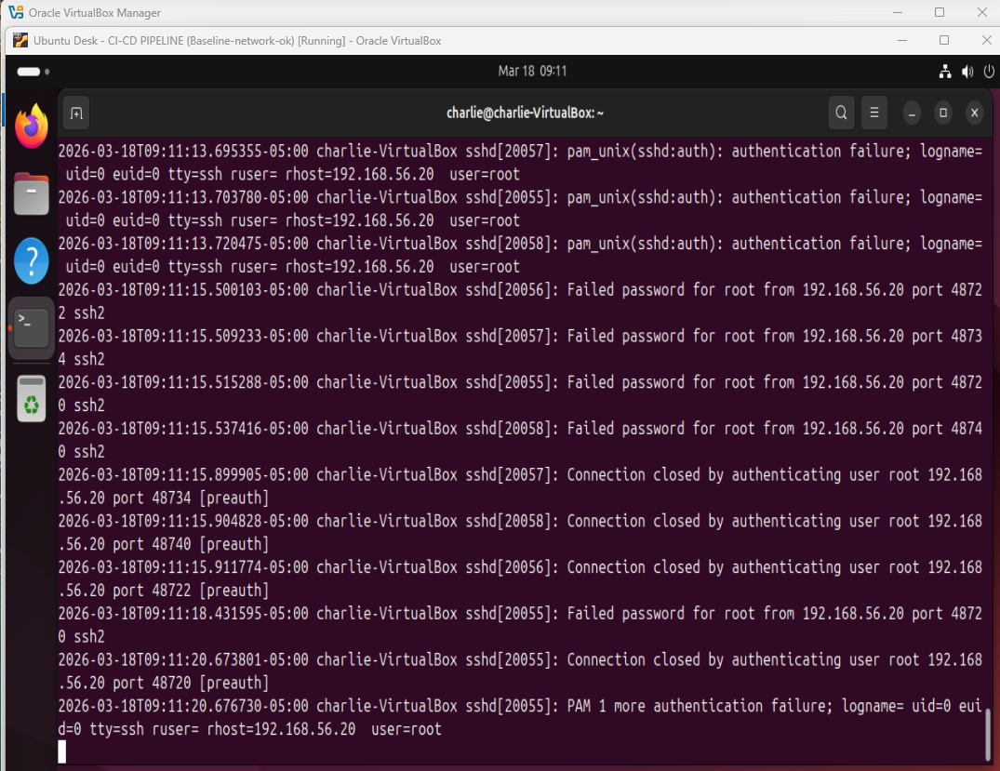

# 🔍 Architecture Validation & Detection Proof  
## Focus Area: Secure-by-Design Detection Capability in Distributed Lab Architecture

---

# 🔁 Architecture Validation Context

This section validates that the secure-by-design lab architecture is not only deployed, but operationally effective.

The validation process confirms that the architecture supports:

- Secure endpoint telemetry collection
- Wazuh agent-to-manager communication
- File Integrity Monitoring detection
- SSH brute-force detection
- Security event ingestion and correlation
- Alert investigation through the dashboard
- End-to-end detection pipeline visibility

The validation shifts the architecture review from:

> “Was the environment built?”

To:

> “Can the environment detect and evidence security activity under controlled conditions?”

---

# 🧪 1. Experimental Environment Validation

## 🎯 Objective

Confirm that the Wazuh dashboard, registered agents, and baseline security events are visible before running controlled validation tests.

This establishes the baseline state of the architecture.

---

## 📊 Validation Scope

| Validation Area | Purpose |
|----------------|---------|
| Wazuh Dashboard Overview | Confirm dashboard availability |
| Agent Connectivity | Confirm endpoint-to-manager communication |
| Baseline Security Events | Confirm security telemetry is already flowing |

---

## 🖼️ Evidence

### Wazuh Dashboard Overview

### Agent Connectivity Status

### Baseline Security Events

---

## 📌 Observation

- Wazuh dashboard is accessible.
- Agent successfully connected.
- Events are flowing into the SIEM.
- The system is ready for controlled validation.

---

# 🧪 2. File Integrity Monitoring Validation

## 🎯 Objective

Validate that the architecture can detect unauthorized or unexpected file changes on monitored endpoints.

File Integrity Monitoring is important because it provides visibility into changes that may indicate:

- Unauthorized modification
- Privilege abuse
- Persistence attempts
- System tampering

---

## ⚙️ Validation Action

A controlled file modification was performed on the monitored endpoint to trigger Wazuh File Integrity Monitoring.

Example command:

bash: echo "test" >> /etc/passwd

Note: This command is used only in a controlled lab environment. In production systems, modifying sensitive system files such as /etc/passwd must not be performed without strict approval.

---
### File Modification Command Execution

### Local System Log Confirmation

### Wazuh FIM Detection Alert

---
## 📌 Key Insight

The file modification was successfully detected.
This confirms:
- Log collection ✅
- File Integrity Monitoring engine ✅
- Alert generation ✅
- Endpoint visibility ✅
---

## 🧪 3. SSH Service & Network Validation
#🎯 Objective

Confirm that SSH is active on the target system and that the attack simulation node can communicate with the monitored endpoint.

This validates the architecture’s internal communication path before controlled attack testing.

## ⚙️ Validation Actions

- Check SSH service status: sudo systemctl status ssh
- Confirm network reachability: ping <target-ip>
Example:
ping 192.168.56.10

### Network Connectivity Test

📌 Observation:
- SSH service active.
- Network communication between nodes confirmed.

---

## 🧪4.Attack Preparation
🎯 Objective
Prepare a controlled password list for SSH brute-force simulation.
This ensures the attack test is repeatable, limited, and safe within the lab environment.

### Password List Preparation
Prepare a controlled password list:
- nano passwords.txt
Example password list:
- admin
- password
- ubuntu
- test123
- letmein

📌 Purpose:
- Enable controlled brute-force simulation.
---
# 🧪 5. Brute Force Attack Execution
🎯 Objective
Simulate an SSH brute-force attack from the adversary machine to validate whether the architecture detects authentication abuse.

This test aligns with:
### Hydra Attack Launch

### SSH Authentication Failures (Target Logs)
Launch a controlled Hydra SSH brute-force simulation from Kali Linux:
hydra -l ubuntu -P passwords.txt ssh://192.168.56.10

Alternative format:

hydra -l <username> -P <password-list> ssh://<target-ip>

## 📌 Key Validation:
- Attack successfully generated.
- Failed login attempts recorded in system logs.

## 📌 Observation
SSH service is active.
Network communication between nodes is confirmed.
The environment is ready for controlled brute-force simulation.

## 📌 Key Validation
Attack was successfully generated.
SSH failed login attempts were recorded in target system logs.
The architecture produced the necessary telemetry for SIEM ingestion.

## 🧪 6. Detection & Correlation Validation
🎯 Objective
Validate that Wazuh receives SSH authentication failure events and correlates them into security alerts.
This confirms that detection is not limited to local logs. It proves that telemetry is moving through the full monitoring pipeline.

## 🧠 Detection Flow
Kali Attack → Ubuntu SSH Logs → Wazuh Agent → Wazuh Manager → Dashboard Alert

### Detection Pipeline Evidence

## 📌 This demonstrates:
- Real log ingestion  
- Detection event generation  
- SIEM correlation in action  
- Wazuh SSH Event Ingestion
- Brute Force Detection Alert

## 📌 Insight
Logs were ingested into Wazuh.
Detection rules were triggered.
Correlation engine functioned correctly.
Brute-force activity became visible in the dashboard.

## 🧪 7. Alert Investigation
🎯 Objective
Investigate the generated Wazuh alert to confirm that it contains useful security context.
This validates whether the alert is actionable, not just visible.

## 🔍 Investigation Focus

The alert was reviewed for:
- Source IP address
- Target system
- Authentication failure pattern
- Rule classification
- Severity level
- Timestamp correlation

## 📌 Observation

The alert includes:
- Source IP
- Attack pattern
- Rule classification
- Event context
This confirms that the SIEM provides investigation-ready security evidence.

## 📌 Architecture Validation Outcome

## 📊 Key Architecture Validation Findings
The secure-by-design architecture successfully demonstrated:
- Attack generation
- Local log creation
- Agent telemetry forwarding
- Wazuh event ingestion
- Rule-based detection
- Alert visualization
- Investigation-ready evidence

---

## 📊 9. Key Architecture Validation Findings

| Validation Area | Result |
|---|---|
| Attack generation | ✅ Successful |
| Local log creation | ✅ Successful |
| Agent telemetry forwarding | ✅ Successful |
| Wazuh event ingestion | ✅ Successful |
| Rule-based detection | ✅ Successful |
| Alert visualization | ✅ Successful |
| Investigation-ready evidence | ✅ Successful |
| Wazuh dashboard availability | ✅ Successful |
| Agent connectivity | ✅ Successful |
| Baseline event visibility | ✅ Successful |
| File Integrity Monitoring | ✅ Successful |
| SSH service readiness | ✅ Successful |
| Network communication | ✅ Successful |
| Brute-force event generation | ✅ Successful |
| Wazuh log ingestion | ✅ Successful |
| Alert correlation | ✅ Successful |
| End-to-end detection pipeline | ✅ Validated |
